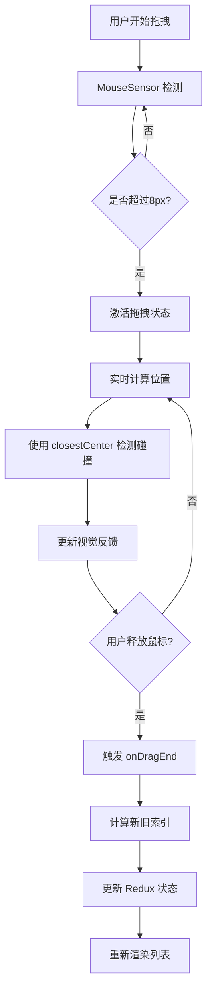
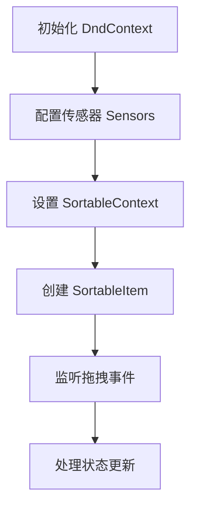
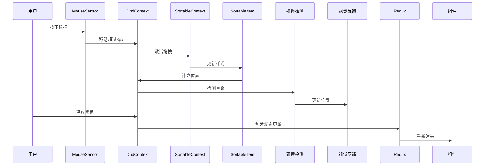

```mermaid
graph TD
    A[用户开始拖拽] --> B[MouseSensor 检测]
    B --> C{是否超过8px?}
    C -->|否| B
    C -->|是| D[激活拖拽状态]
    D --> E[实时计算位置]
    E --> F[使用 closestCenter 检测碰撞]
    F --> G[更新视觉反馈]
    G --> H{用户释放鼠标?}
    H -->|否| E
    H -->|是| I[触发 onDragEnd]
    I --> J[计算新旧索引]
    J --> K[更新 Redux 状态]
    K --> L[重新渲染列表]
```

```mermaid
graph TD
    A[初始化 DndContext] --> B[配置传感器 Sensors]
    B --> C[设置 SortableContext]
    C --> D[创建 SortableItem]
    D --> E[监听拖拽事件]
    E --> F[处理状态更新]
```

```mermaid
sequenceDiagram
    用户->>MouseSensor: 按下鼠标
    MouseSensor->>DndContext: 移动超过8px
    DndContext->>SortableContext: 激活拖拽
    SortableContext->>SortableItem: 更新样式
    SortableItem->>DndContext: 计算位置
    DndContext->>碰撞检测: 检测重叠
    碰撞检测->>视觉反馈: 更新位置
    用户->>DndContext: 释放鼠标
    DndContext->>Redux: 触发状态更新
    Redux->>组件: 重新渲染
```
